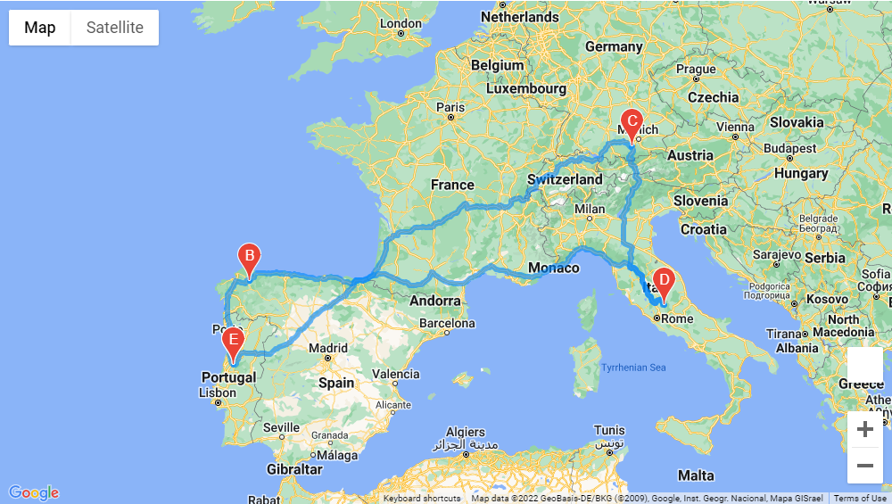
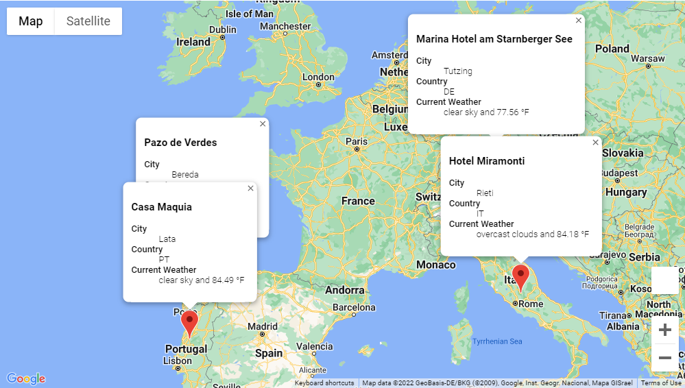

# PlanMyTrip

PlanMyTrip is a program that chooses 2000 random world destinations and uses those destinations to select your prefered travel destination based on weather temperatures. Then it finds the nearest hotel to those destinations.

### Resources
- Python 3.7.x
- Jupyter Notebook
- Gmaps API
- Open Weather API

### This program includes:
- 2000 real world locations
- Real time weather data using OpenWeather API
- Nearest hotels at locations using GMAPS API

### Example
As an example, I have provided an itinerary of 4 different cities in Europe based on user selected weather conditions, and planned a route between those cities using the GMAPS API.

##### Travel Route

##### Destinations Route

